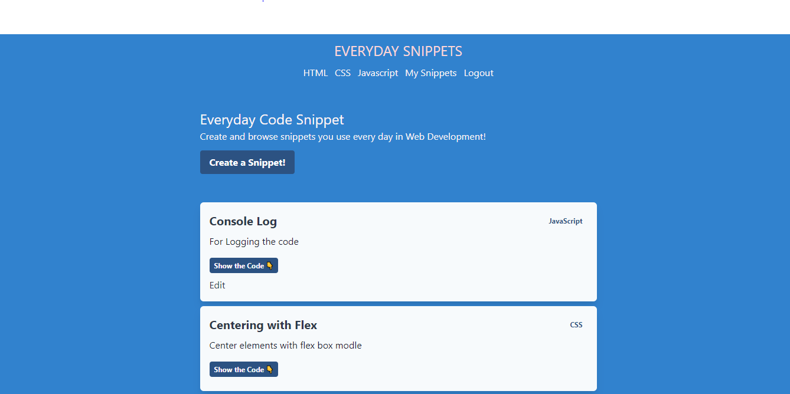

<<<<<<< HEAD
# next-snippets
=======

Project build and improved upon a course from James Q Quick from his youtube tutorial(https://www.youtube.com/watch?v=1GpbdX8aJCU&ab_channel=JamesQQuick).
Project is done with technologies like Next.js, Auth0, FaunDB with tailwind css

Step 1 : Clone the repository

Step 2 : yarn add or npm install

Step 3 : npm run dev  or yarn dev 

Open [http://localhost:3000](http://localhost:3000) with your browser to see the result.
